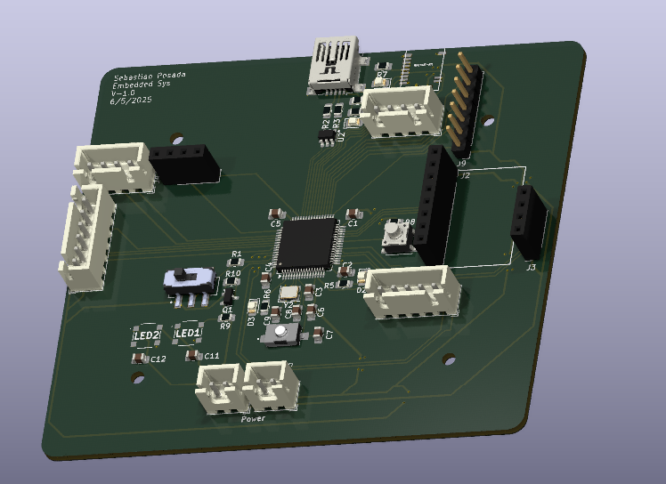
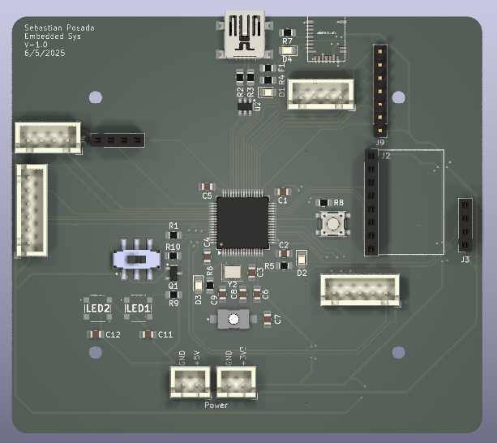
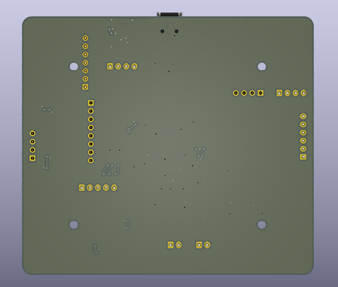
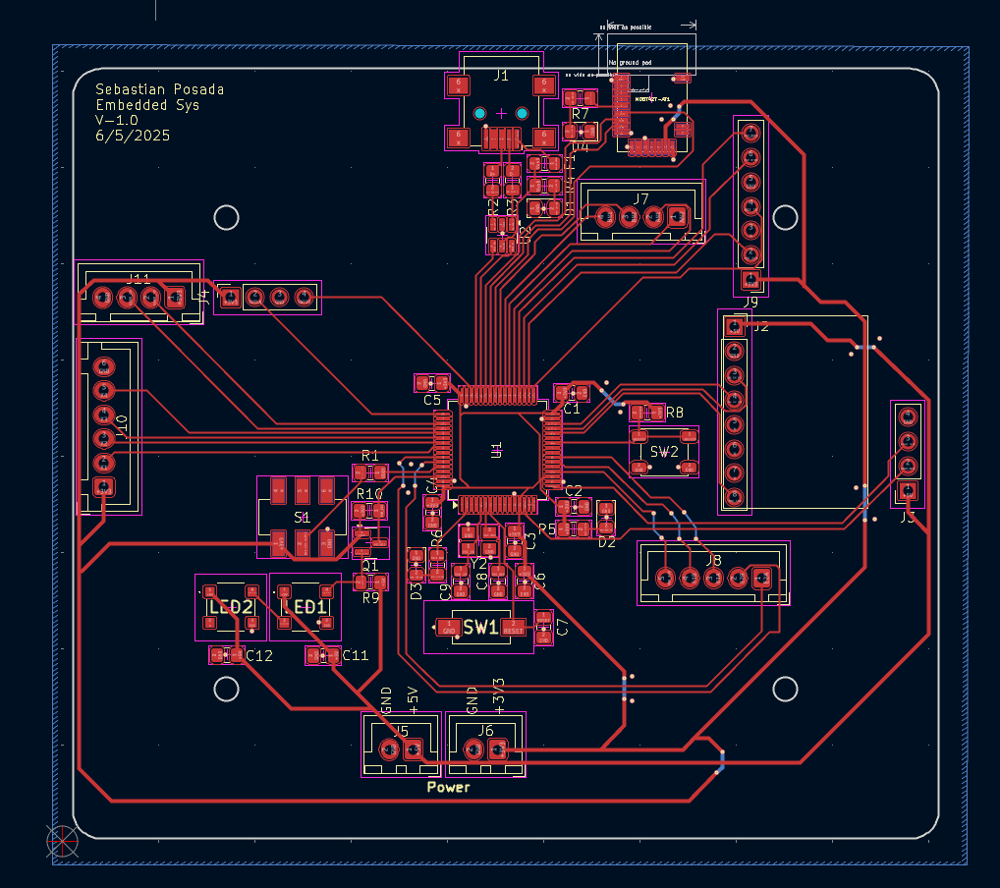

# STM32 Robot Brain PCB

A custom controller board for a small mobile robot, designed in KiCad. It's built around an **STM32F103RCT6** microcontroller and brings together motor drive, sensor, Bluetooth, and programming connections on one 2-layer board.



## Features

- **MCU:** STM32F103RCT6 (ARM Cortex-M3, LQFP-64) with a 16 MHz crystal
- **Bluetooth:** MDBT42T-AT module (nRF52-based BLE)
- **USB:** Mini-B connector with USBLC6-2SC6 ESD protection and a resettable PTC fuse
- **Programming:** SWD header, plus BOOT and RESET switches
- **Sensor headers:** MPU6050 IMU and ultrasonic distance sensor
- **Robot I/O:** motor driver, Hall-effect encoders, track sensor, PS2 controller, and UART (JST-XH connectors)
- **Power:** separate 5 V and 3.3 V inputs, with power indicator LEDs
- **User I/O:** user button, user LED, Bluetooth status LED, and two RGB LEDs
- **Level shifting:** BSS138 MOSFET

## Images

| Top | Bottom |
|---|---|
|  |  |



The full schematic is in [images/schematic.pdf](images/schematic.pdf).

## Repository layout

```
hardware/
  *.kicad_pro / .kicad_sch / .kicad_pcb   KiCad project, schematic, and layout
  motor_controller.kicad_sch               Motor controller sub-sheet
  components/                              Custom symbols, footprints, and 3D models
  BOM/                                     Bill of materials (CSV)
  gerber/                                  Fabrication files (Gerbers and drill files)
images/                                    Renders and schematic PDF
```

## Opening the project

1. Install [KiCad](https://www.kicad.org/) (version 8 or newer).
2. Open `hardware/2025_04_STM32F103_RobotBrain.kicad_pro`.

To order boards, zip the contents of `hardware/gerber/` and upload them to a PCB fab such as JLCPCB or PCBWay.

## Context

Designed for an embedded systems course (ENCE 4231), spring 2025.
